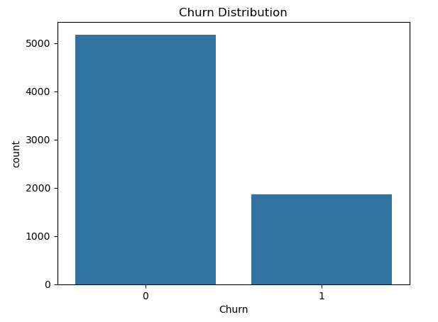
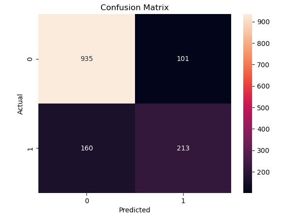

# Customer Churn Prediction

## 📌 Problem

Predict whether a customer will churn based on historical data.

## 📊 Dataset

Telco Customer Churn dataset (~7000 records)

## 🛠️ Tools Used

* Python (Pandas, NumPy)
* Scikit-learn
* Matplotlib, Seaborn

## 🔍 Steps Performed

* Data Cleaning (handled missing values, converted data types)
* Exploratory Data Analysis (EDA)
* Feature Encoding
* Feature Scaling (StandardScaler)
* Model Building (Logistic Regression)

## 🤖 Model Performance

* Accuracy: **81.47%**

## 📈 Key Insights

* Customers with higher monthly charges are more likely to churn
* Contract type strongly affects churn
* Longer tenure customers are less likely to churn

## 📷 Visualizations

## 🚀 How to Run

1. Download the project
2. Install libraries:
   pip install pandas numpy matplotlib seaborn scikit-learn
3. Run the notebook

## 👩‍💻 Author

Mariya Pathoriya
